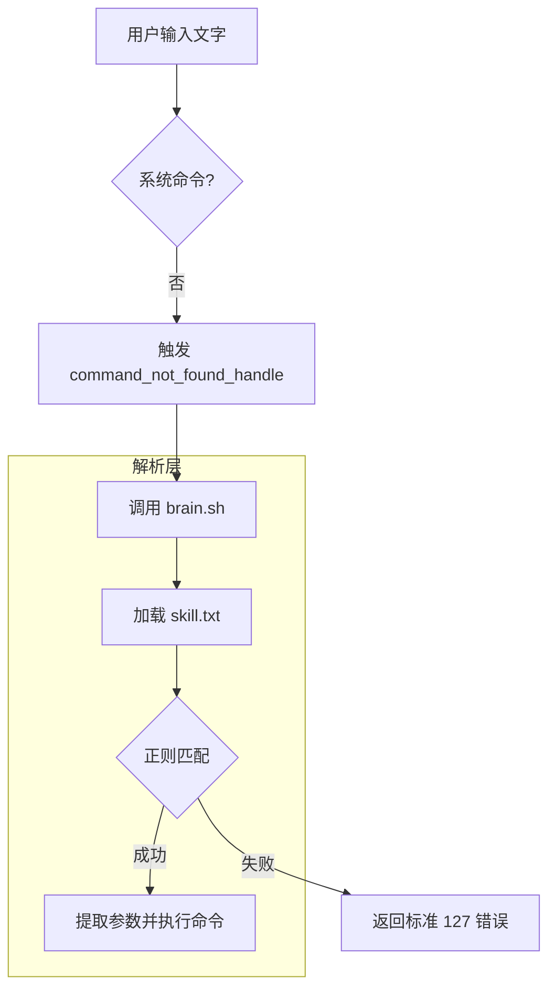

## 1. 背景：日志路径太长了，记不住
Linux 环境下，经常需要运行各种命令（如：查询日志、部署应用、清理缓存）。路径比较长的时候特别烦。

**如何快捷执行命令？**

用alias可以简化命令输入，但也有缺点：
1. **参数不灵活**：alias 很难处理复杂的参数位置。
2. **记忆成本高**：alias 必须是固定的缩写，记多了容易混淆。
3. **维护麻烦**：分散在 `.bashrc` 中的别名让配置文件混乱不堪。

想实现：用户在终端直接输入大白话，如：**“查询日志 关键字”**，终端就能自动识别意图并执行业务日志查询。

---

## 2. 核心思路：拦截“命令未找到”异常
可以利用 Bash 的一个隐藏“黑科技”：`command_not_found_handle`。
当你在终端输入一个不存在的命令时，系统会默认报错。但如果我们在 `.bashrc` 中定义了这个函数，它就能接管这个异常，把输入传给我们的“中控脚本”进行逻辑处理。

---

## 3. 系统架构
整个系统（暂命名为：minicli）由三个部分组成：
* **拦截器**：配置在 `.bashrc` 中，负责捕获无效输入，并传入`大脑`。
* **大脑 (brain.sh)**：加载`技能表`，解析用户输入并匹配执行相应脚本。
* **技能表 (skill.txt)**：纯文本配置，维护“正则表达式”与“脚本”的映射关系。


### 执行流程图


---

## 4. 代码实现

---
备注：后续代码文件都放在 `~/.minicli/` 目录下

---

### 第一步：配置技能表 `skill.txt`
采用 `正则表达式 :: 执行命令` 的格式。支持通过 `(.*)` 捕获参数
```text
# minicli 技能映射表
# 格式：正则表达式 :: 执行命令
# ---------------------------------------------------------

# 示例 1: 无分组匹配 (自定义脚本、自动将空格后的内容作为参数)
^查询日志          :: sh ~/.minicli/qlog.sh

# 示例2：分组匹配，查询系统日志
^系统日志 (.*)     ::  grep $1 /var/log/messages

# 示例 3: 分组匹配 (通过 $1, $2 引用括号内容)
^清理(缓存|日志)$  :: echo "正在清理: $1..."

# 示例 4: 固定指令
^系统|状态$         :: df -h && free -m

```

### 第二步：编写中控脚本 `brain.sh`
核心逻辑是遍历配置skill.txt，使用 Bash 原生的正则匹配 `用户输入` 和 `对应的命令`。
```bash
#!/bin/bash

INPUT_STR="$*"
SKILL_FILE="$(dirname "$0")/skill.txt"

# 检查配置文件
[[ ! -f "$SKILL_FILE" ]] && exit 127

while read -r line || [[ -n "$line" ]]; do
    [[ -z "$line" || "$line" =~ ^[[:space:]]*# ]] && continue

    # 分割正则和命令 (使用 :: 分隔)
    REGEX="${line%%::*}"
    COMMAND="${line#*::}"
    REGEX=$(echo "$REGEX" | xargs)
    COMMAND=$(echo "$COMMAND" | xargs)

    # 执行正则匹配
    if [[ "$INPUT_STR" =~ $REGEX ]]; then
        # 检查正则中是否包含捕获组 (即是否有括号)
        # 统计 BASH_REMATCH 数组长度，${#BASH_REMATCH[@]} > 1 表示有括号
        if [ ${#BASH_REMATCH[@]} -gt 1 ]; then
            # --- 模式 A：捕获组替换模式 ---
            FINAL_CMD="$COMMAND"
            for i in "${!BASH_REMATCH[@]}"; do
                # 跳过 $0 (它是匹配到的全量字符串)
                [[ $i -eq 0 ]] && continue
                FINAL_CMD="${FINAL_CMD//\$$i/${BASH_REMATCH[$i]}}"
            done
        else
            # --- 模式 B：空格自动传参模式 ---
            # 提取第一个空格后的所有内容
            AUTO_ARGS="${INPUT_STR#* }"
            if [[ "$INPUT_STR" == "$AUTO_ARGS" ]]; then
                # 说明输入中没有空格，只有关键词
                FINAL_CMD="$COMMAND"
            else
                FINAL_CMD="$COMMAND $AUTO_ARGS"
            fi
        fi

        # 执行最终命令
        eval "$FINAL_CMD"
        exit $?
    fi
done < "$SKILL_FILE"

exit 127
```

### 第三步：注入拦截器
在 `~/.bashrc` 末尾添加：
```bash
command_not_found_handle() {
    ~/.minicli/brain.sh "$@"
    local status=$?
    [ $status -eq 127 ] && echo "bash: $1: command not found"
    return $status
}
```

---

## 5. 最终效果
现在，我的终端变得非常智能：
* 输入 `查询日志 requestId` -> **自动触发** 日志查询脚本。
* 输入 `重启` -> **自动触发** 应用重启。
* 输入正常的 `ls`, `cd` -> **无感运行**，没有任何副作用。

## 6. 总结
这种方案最优雅的地方在于**解耦**。
如果团队里想增加新功能，只需要在 `skill.txt` 里加一行配置即可，无需修改任何代码，也无需重新加载 shell。
brain.sh这里其实可以接入聪明的LLM，实现更智能，目前版本是硬智能😓

---

## 7. One More Thing 工程化

把以上内容封装为一个 `minicli_install.sh`，可以一键安装。
安装完，可以查看 `tree ~/.minicli/` , 可以编辑skill.txt添加功能

```
#!/bin/bash

# ==========================================
# minicli 一键安装配置脚本
# ==========================================

INSTALL_DIR="$HOME/.minicli"
BRAIN_PATH="$INSTALL_DIR/brain.sh"
SKILL_PATH="$INSTALL_DIR/skill.txt"
BASHRC="$HOME/.bashrc"
ZSHRC="$HOME/.zshrc"

echo "🚀 正在启动 minicli 安装程序..."

# 1. 创建私有目录
mkdir -p "$INSTALL_DIR"

# 2. 生成 brain.sh 模板
echo "🧠 正在生成解析引擎 (brain.sh)..."
cat << 'EOF' > "$BRAIN_PATH"
#!/bin/bash

# ==========================================
# minicli 核心解析引擎
# ==========================================

INPUT_STR="$*"
INSTALL_DIR="$HOME/.minicli"
SKILL_FILE="$INSTALL_DIR/skill.txt"

[[ ! -f "$SKILL_FILE" ]] && exit 127

while read -r line || [[ -n "$line" ]]; do
    [[ -z "$line" || "$line" =~ ^[[:space:]]*# ]] && continue

    # 分割正则和命令 (使用 :: 分隔)
    REGEX="${line%%::*}"
    COMMAND="${line#*::}"
    REGEX=$(echo "$REGEX" | xargs)
    COMMAND=$(echo "$COMMAND" | xargs)

    # 逻辑判断：执行匹配
    if [[ "$INPUT_STR" =~ $REGEX ]]; then
        # 模式 A：捕获组替换 (如果正则包含括号)
        if [ ${#BASH_REMATCH[@]} -gt 1 ]; then
            FINAL_CMD="$COMMAND"
            for i in "${!BASH_REMATCH[@]}"; do
                [[ $i -eq 0 ]] && continue
                FINAL_CMD="${FINAL_CMD//\$$i/${BASH_REMATCH[$i]}}"
            done
        else
            # 模式 B：空格自动传参 (如果无括号)
            AUTO_ARGS="${INPUT_STR#* }"
            if [[ "$INPUT_STR" == "$AUTO_ARGS" ]]; then
                FINAL_CMD="$COMMAND"
            else
                FINAL_CMD="$COMMAND $AUTO_ARGS"
            fi
        fi

        # 执行并退出
        eval "$FINAL_CMD"
        exit $?
    fi
done < "$SKILL_FILE"

exit 127
EOF

# 3. 生成 skill.txt 模板
echo "📜 正在初始化技能表 (skill.txt)..."
cat << 'EOF' > "$SKILL_PATH"
# minicli 技能映射表
# 格式：正则表达式 :: 执行命令
# ---------------------------------------------------------

# 示例 1: 无分组匹配 (自定义脚本、自动将空格后的内容作为参数)
^查询日志          :: sh ~/.minicli/qlog.sh

# 示例2：分组匹配，查询系统日志
^系统日志 (.*)     ::  grep $1 /var/log/messages

# 示例 3: 分组匹配 (通过 $1, $2 引用括号内容)
^清理(缓存|日志)$  :: echo "正在清理: $1..."

# 示例 4: 固定指令
^系统|状态$         :: df -h && free -m
EOF

# 4. 权限设置
chmod +x "$BRAIN_PATH"

# 5. 注册到 Shell 配置文件 (Bash & Zsh)
register_to_rc() {
    local rc_file=$1
    local handler_name=$2

    if [ -f "$rc_file" ]; then
        if ! grep -q "minicli" "$rc_file"; then
            echo "📝 正在配置 $rc_file..."
            cat << EOF >> "$rc_file"

# >>> minicli config start >>>
$handler_name() {
    if [ -x "$BRAIN_PATH" ]; then
        "$BRAIN_PATH" "\$@"
        local status=\$?
        [ \$status -eq 127 ] && echo "bash: \$1: command not found..."
        return \$status
    fi
    return 127
}
# <<< minicli config end <<<
EOF
        fi
    fi
}

register_to_rc "$BASHRC" "command_not_found_handle"
register_to_rc "$ZSHRC" "command_not_found_handler"

echo "--------------------------------------------"
echo "✅ minicli 安装成功！"
echo "📂 目录位置: $INSTALL_DIR"
echo "🛠️  配置文件: $SKILL_PATH"
echo "✨ 请执行 'source ~/.bashrc' (或 zshrc) 使其生效"
echo "--------------------------------------------"
```


**💡 小贴士**：
如果你是 Zsh 用户，请将函数名改为 `command_not_found_handler`（多一个 **r** 喔）。

--- 
